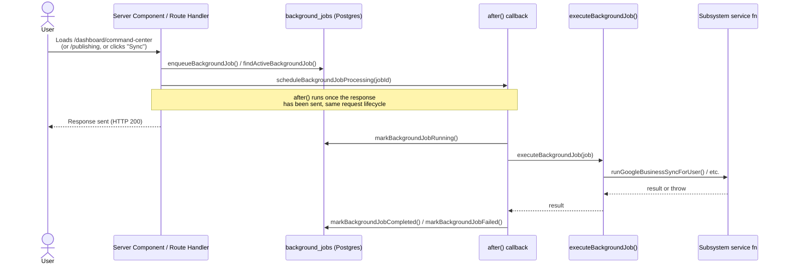

# ADR: Autonomous Execution Architecture for AJN Marketing

- **Status:** Proposed
- **Date:** 2026-07-09
- **Author:** Investigation performed by Claude Code on branch `investigate-autonomous-scheduler`
- **Scope:** This document is investigation and architecture only. No production behavior was changed. A single isolated diagnostic route was added, exercised locally, and deleted before commit (see [Appendix A](#appendix-a-proof-of-concept-performed)).

---

## 1. Summary

AJN Marketing's automated subsystems (Market Context Agent, Autonomous Publishing Engine, Analytics Feedback Loop, Google Business Profile sync, review monitoring, background job queue) only execute as a side effect of a specific user loading a specific page. There is no process that runs on a schedule, for all tenants, independent of user activity. A previous attempt at a cross-user scheduler exists in the codebase but is dead code that would silently no-op if invoked, because it uses a session-bound Supabase client with no way to authenticate as anything other than "whoever is currently browsing."

**Recommendation:** adopt [Trigger.dev](https://trigger.dev) as the durable task-orchestration layer, triggered by its own native cron/event primitives, executing against a new Supabase *service-role* client, while keeping the existing `background_jobs` / `publishing_jobs` tables and `audit_logs` as the user-facing system of record. Full justification in [§4](#4-decision).

---

## 2. Current Architecture

### 2.1 How jobs execute today

There is exactly **one** call site for Next.js's `after()` in the entire codebase: [`lib/background-jobs/scheduler.ts:19`](../lib/background-jobs/scheduler.ts). Every "background" operation in the product funnels through it, directly or indirectly.



Concretely, the trigger points are:

| Trigger point | File | Fires when |
|---|---|---|
| `processQueuedBackgroundJobsForUser()` | `lib/background-jobs/service.ts:92` | `listBackgroundJobsForCurrentUser()` is called — i.e. the Command Center's job panel renders |
| `scheduleBackgroundJobProcessing()` | called from `queueBackgroundJobForCurrentUser`, `patchBackgroundJobForCurrentUser`, `queueBackgroundJobForProfile` | A user explicitly queues or retries a job (e.g. clicks "Sync Google Business") |
| `processDueScheduledPublishingJobsForUser()` | `app/api/publishing/route.ts:33`, `lib/publishing-server.ts:21` | The Publishing page or `GET /api/publishing` loads |
| `queueAnalyticsCaptureForUser()` | `lib/publishing/publishingEngine.ts:509`, `lib/google-business/sync.ts:189` | A publish completes or a GBP sync completes (chained, still ultimately user-triggered) |

**If no user with an active session loads the relevant page, nothing runs.** A post scheduled for 9:00am will not publish until someone opens `/dashboard/publishing` after 9:00am. A weekly Market Context brief is only regenerated when a user clicks "Refresh" on `/dashboard/market-context` — there is no actual weekly cadence today despite the name. Google Business Profile sync, review polling, and analytics capture behave identically.

### 2.2 Why `after()` is insufficient

`after()` is a **request-lifecycle extension**, not a scheduler. It has no concept of "run this for every tenant, every N hours." Specifically:

1. **No external trigger.** `after()` only runs after a response is generated for an inbound request. There is nothing in this codebase, in Vercel, or in Supabase that generates that inbound request on a timer.
2. **Bound to the triggering user's session.** Every service function in `lib/*/service.ts` (`runGoogleBusinessSyncForUser`, `runWebsiteAnalysisForUser`, `runAnalyticsFeedbackLoopForUser`, etc.) internally calls `createClient()` from [`lib/supabase/server.ts`](../lib/supabase/server.ts), which requires `next/headers`' `cookies()` — a Next.js request-scoped API. This client authenticates as **whichever user's cookies happened to be on the inbound request**. It cannot authenticate as "the system," and it cannot iterate across tenants.
3. **Serverless execution ceiling.** Even within a single `after()` invocation, Vercel Functions have a duration limit (see [§3](#3-candidate-architectures)); a single request cannot safely fan out to thousands of tenants' worth of work.

### 2.3 Existing scheduler code (broken)

[`lib/publishing/publishingScheduler.ts`](../lib/publishing/publishingScheduler.ts) contains two functions:

```ts
export async function processDueScheduledPublishingJobsForUser(userId: string): Promise<number> { ... }
export async function processDueScheduledPublishingJobs(): Promise<number> { ... }  // no userId — never called anywhere
```

The second function is clearly an attempt at a cross-user sweep (`getDueScheduledPublishingJobs(supabase)` with no `userId` filter, intended to return due jobs for *all* users). It is dead code — `grep` across the repo confirms it has zero callers. Even if wired up, it would not work: it calls `createClient()` (§2.2), which — outside of an authenticated request — produces an anonymous Supabase client. Every table in this schema has RLS policies of the shape `auth.uid() = user_id`; an anonymous client's `auth.uid()` is `null`, so **every query returns zero rows, silently, with no error.** This was verified empirically (see [Appendix A](#appendix-a-proof-of-concept-performed)) rather than assumed from reading the code.

This is the most important finding in this investigation: **the failure mode of naively cron-triggering the existing code is not a crash — it's a scheduler that appears to run successfully forever while doing nothing.**

### 2.4 Existing queues

Two parallel queue-like structures exist, at different layers:

- **`background_jobs`** (migration `011`) — a generic job table (`job_type`, `status`, `priority`, `payload`, `result`, `attempts`) covering 11 job types (`BackgroundJobTypes` in `lib/background-jobs/types.ts`), including three that are stubbed for future social platforms (`facebook_sync`, `instagram_sync`, `linkedin_sync` — these throw `"This integration sync is not available yet."` in `worker.ts:24`). `executeBackgroundJob()` (`lib/background-jobs/worker.ts`) is a clean `switch` dispatcher that already calls into every subsystem's real service function. **This dispatcher is reusable almost as-is** by whatever orchestrator is chosen — it's the one piece of this system that doesn't need to be rebuilt.
- **`publishing_jobs`** / **`publishing_history`** (migration `013`) — a purpose-built queue specifically for the publishing pipeline, with its own status machine (`queued → scheduled → publishing → published/verified → retrying → failed/cancelled`) and its own retry math.

These two systems duplicate some responsibility (both track attempts/retries; publishing jobs can *also* be wrapped in a `background_jobs` row via `BackgroundJobTypes.PUBLISHING_EXECUTE`). This is not a blocker, but it's worth simplifying during migration rather than adding a third parallel system on top.

### 2.5 Existing retry system

Two different retry strategies exist side by side today:

| | `background_jobs` | `publishing_jobs` |
|---|---|---|
| Max attempts | 3 (`MAX_BACKGROUND_JOB_ATTEMPTS`) | 3 (`MAX_PUBLISHING_RETRIES`) |
| Backoff | **None** — immediate requeue via `scheduleBackgroundJobProcessing()` in the same `after()` invocation's catch block | **Exponential** — `lib/publishing/retryManager.ts`: `30_000 * 4^(retryCount-1)` ms → 30s, 120s, 480s |
| Verification step | None | Yes — `publishVerifier.ts` checks the provider actually reports a live post before marking `verified` vs `published` |
| Dedup | `findActiveBackgroundJob()` — one active job per `(user, jobType, businessProfile)` | `getActivePublishingJobForContent()` — one active job per content item |

The publishing pipeline's retry design (exponential backoff + verification + dedup) is genuinely well-built and should be **preserved as policy**, just re-hosted on whichever orchestrator is chosen, rather than reinvented.

### 2.6 Existing audit logging

`lib/audit-log/*` + `lib/audit-log-server.ts` provide `logAuditEvent()` writing to the `audit_logs` table (migration `010`), with a consistent `{STARTED, COMPLETED, FAILED}` action-triple convention used across website analysis, GBP sync, publishing, analytics, and (as of the most recent fix) AI marketing profile generation. Metadata is sanitized before storage (`sanitizeMetadata()` strips token/secret-shaped keys, truncates long strings). `audit_logs` has RLS (`auth.uid() = user_id`, select/insert only — append-only by design) so **it is already correctly the user-facing history record**, independent of whatever orchestrates execution. This should not change.

### 2.7 Infrastructure facts gathered

- **Hosting:** Vercel (confirmed via the repo's GitHub Actions/PR checks — no `vercel.json`, no cron config exists today).
- **Database:** Supabase, Postgres 17.6, project `AJN marketing` (`dqcsptbgladjfdbybeda`), region `us-west-2`.
- **Installed Postgres extensions:** `pg_stat_statements`, `pgcrypto`, `plpgsql`, `supabase_vault`, `uuid-ossp`. **`pg_cron` and `pg_net` are not installed.**
- **Service-role credential:** A service-role key (legacy JWT and the newer `sb_secret_...` key) already exists at the Supabase project level but is **not referenced anywhere** in `.env.local`, Vercel env vars (as far as this repo's config reveals), or CI secrets. No code in the repo constructs a service-role client today. *(Note: while confirming this, the CLI printed the legacy service-role JWT in full to this session's output — flagged separately to the user for rotation; not reproduced here.)*
- **RLS:** enabled on all 15 tables, consistently `auth.uid() = user_id` (or a join through a table that has that check). No gaps. This is good news for tenant isolation but is precisely what makes the current architecture inert for cross-tenant execution.

---

## 3. Candidate Architectures

Evaluated against: reliability, cost, ease of development, local dev experience, retry capabilities, multi-tenant execution, security, service-role requirements, RLS implications, monitoring, logging, failure recovery, vendor lock-in, and scalability to thousands of businesses.

### 3.1 Vercel Cron

- **What it is:** `vercel.json`-configured HTTP triggers that hit a Next.js Route Handler on a schedule.
- **Reliability:** Hobby plan only guarantees the trigger fires *within the hour*, not at the exact minute; Pro/Enterprise get per-minute precision, and Enterprise adds invocation guarantees. Up to 100 cron jobs per project on every plan as of 2026.
- **Cost:** No separate line item — cron invocations bill as regular Vercel Function executions.
- **Ease of development:** Trivial to declare (a JSON entry + a route handler). No new SDK.
- **Local dev experience:** Poor. There is no way to simulate a cron firing locally; you either hit the route by hand or deploy to test.
- **Retry:** None built in — a failed invocation just... fails, until the next scheduled tick.
- **Multi-tenant execution:** Not provided. The route handler itself must iterate every tenant, which means hand-rolling fan-out, batching, and concurrency control, and doing so **within a single function's duration limit** (800s GA on Pro/Enterprise with Fluid Compute, up to 30 min in beta).
- **Security / service-role:** The route handler needs to authenticate itself as "the system," not a user — requires exactly the service-role client this architecture is currently missing (§2.7), plus a shared secret to stop the endpoint being called by anyone who finds the URL.
- **Monitoring/logging:** Standard Vercel function logs only; no job-level dashboard.
- **Vendor lock-in:** Total — this is Vercel-proprietary configuration.
- **Verdict:** Good as a **trigger**, not sufficient as the whole answer — it has no orchestration, retry, or fan-out primitives of its own.

### 3.2 Supabase pg_cron

- **What it is:** A Postgres extension that runs SQL or (via `pg_net`) HTTP calls on a schedule, from inside the database itself. As of 2026, `pg_cron` ships enabled by default on Free/Pro/Team Supabase plans (confirmed via extension listing this project does **not** yet have it installed — it must be explicitly enabled).
- **Reliability:** Runs inside Postgres; Supabase's own guidance recommends **no more than 8 concurrent jobs, each running no more than 10 minutes** — a real ceiling to design around at scale.
- **Cost:** Included in the Postgres compute you already pay for; no separate billing dimension.
- **Ease of development:** SQL-based scheduling; calling out to TypeScript business logic means firing an HTTP request (via `pg_net`) back to a Vercel route or a Supabase Edge Function.
- **Local dev experience:** Weak — testing scheduled SQL against a local Supabase stack is possible but clunky, and doesn't reflect the HTTP round-trip to application code.
- **Retry:** None native; must be built in the target endpoint.
- **Multi-tenant execution:** Excellent for the *dispatch* step (a `SELECT` across all businesses is exactly what SQL is good at) but not for the *execution* step (heavy work still needs to happen elsewhere).
- **Security / service-role:** Runs with database-level privileges already — no separate service-role key needed for the scheduling step itself, but calling back out to app code still needs one.
- **RLS implications:** `pg_cron` jobs run as whichever Postgres role owns them, typically `postgres`/`supabase_admin` — RLS is bypassed by design at this layer, so cross-tenant SQL queries work naturally here.
- **Monitoring/logging:** `cron.job_run_details` table gives basic run history inside Postgres.
- **Vendor lock-in:** Moderate — standard Postgres extension, but the "invoke Edge Function via `pg_net`" pattern is Supabase-specific glue.
- **Verdict:** Strong as the **trigger and dispatch layer** (SQL is the natural place to compute "which businesses are due"), weak as an **execution** layer.

### 3.3 Supabase Edge Functions

- **What it is:** Deno-based serverless functions, invokable on a schedule via `pg_cron` + `pg_net`, or on demand.
- **Reliability:** Fine for short, I/O-bound work.
- **Cost:** Usage-based, included in most plans up to a quota.
- **Ease of development:** **Requires porting business logic to Deno.** This codebase is 100% Next.js/Node TypeScript with deep `next/headers`, `@supabase/ssr`, and Node-specific dependencies (e.g. `openai` SDK usage patterns tuned for Node). Porting the actual sync/generation logic here is a second implementation to maintain, not a deployment target for the existing one.
- **Local dev experience:** Supabase CLI supports local Edge Function serving; reasonable but a second toolchain alongside Next.js.
- **Retry:** None native.
- **Multi-tenant execution:** Same as pg_cron — fine for dispatch, constrained for real work.
- **Security / service-role:** Edge Functions can be granted service-role access directly via Supabase's function secrets.
- **Monitoring/logging:** Supabase function logs/dashboard.
- **Failure recovery / scalability:** **The binding constraint:** wall-clock limit is 400 seconds, but **CPU time is capped at 200ms per request** (tightened from a historical 2s). This is workable for thin I/O-bound glue (an HTTP call out, a DB write) but risky for anything CPU-heavier — JSON transformation of large payloads, image/content processing, or the (currently heuristic, non-AI) parts of website analysis.
- **Vendor lock-in:** High — Deno-specific code, Supabase-specific deployment.
- **Verdict:** Not a fit as the primary execution layer for this codebase without a costly rewrite. Usable only as thin glue.

### 3.4 Inngest

- **What it is:** A durable-execution/event-orchestration platform purpose-built for exactly this shape of problem: scheduled + event-driven functions, step-level retries, per-key concurrency, multi-tenant fan-out, with a hosted dashboard.
- **Reliability:** Strong — this is the product's core value proposition.
- **Cost:** Execution-based pricing (a function run + each `step.run()` inside it counts separately; a retried step still counts as additional runs). Reasonable at today's scale; needs modeling at "thousands of businesses × multiple job types × daily/weekly cadence" before committing long-term.
- **Ease of development:** Excellent — a single Next.js API route serves as the Inngest handler; functions are plain TypeScript.
- **Local dev experience:** Excellent — `npx inngest-cli dev` runs a full local dashboard showing function runs against your local Next.js dev server.
- **Retry:** Best-in-class — per-step retries (a failure on step 3 of 5 doesn't re-run steps 1–2), configurable backoff.
- **Multi-tenant execution:** First-class — fan-out via events, per-tenant concurrency keys.
- **Security / service-role:** App code still needs its own service-role Supabase client; Inngest itself only orchestrates.
- **Monitoring/logging:** Purpose-built dashboard: every run, every step, replay a single failed run.
- **Vendor lock-in:** Open-source, and a self-hosted path exists (single-binary CLI), but the self-host story is comparatively less emphasized/production-documented than the equivalent for Trigger.dev.
- **Verdict:** Excellent technical fit; the strongest competitor to the recommendation below.

### 3.5 Trigger.dev

- **What it is:** The closest direct competitor to Inngest — scheduled + event-driven durable tasks, TypeScript-native, with a hosted dashboard, and (materially different from Inngest) an explicit, fully-featured **open-source self-hosting path**.
- **Reliability:** Strong — v3 architecture runs tasks in isolated runtime containers, supports tasks running for hours (not just seconds/minutes), with concurrency controls.
- **Cost:** Cloud pricing (as of 2026): Free — 10,000 runs/month, 14-day history. Pro — $50/month, 250,000 runs/month, 30-day history. Team — $200/month, 1,000,000 runs/month, 90-day history. Enterprise — custom, SSO/SOC 2/dedicated infra. **Self-hosted (Apache 2.0, Docker + Postgres): unlimited runs, no feature limitations, infrastructure cost only.**
- **Ease of development:** Excellent — tasks defined as plain TypeScript functions with a `trigger.config.ts`; scheduled tasks and event-triggered tasks use the same primitives.
- **Local dev experience:** Strong CLI-based local dev loop, comparable to Inngest's.
- **Retry:** Automatic retries with configurable exponential backoff, built in per task — directly maps onto the existing `retryManager.ts` policy (§2.5) without hand-rolling it again.
- **Multi-tenant execution:** First-class — scheduled tasks can enumerate tenants and fan out via `trigger.batchTrigger()`/child tasks; concurrency limits can be scoped per tenant key.
- **Security / service-role:** Same requirement as every other option — a service-role Supabase client, held as a Trigger.dev environment secret, never exposed client-side.
- **RLS implications:** None different from any other external orchestrator — RLS still protects every user-facing code path (Next.js app, session-bound); the service-role client used inside tasks is the one deliberate, narrow exception, exactly as it would be for any of these options.
- **Monitoring/logging:** Hosted dashboard with per-run traces; self-hosted deployments get the same dashboard against your own Postgres.
- **Failure recovery:** Configurable retry + explicit failure/dead-letter handling in task definitions.
- **Vendor lock-in:** **Lowest of the purpose-built options.** The Apache 2.0 license and complete (not crippled) self-host path mean that if pricing or company direction ever became a problem, the migration cost is "stand up a Docker container and Postgres database," not "rewrite the orchestration layer."
- **Scalability to thousands of businesses:** Designed for it; and because self-hosting removes the linear per-execution cost as tenant count grows, the cost curve stays predictable at scale in a way pure usage-based cloud billing does not.
- **Verdict:** **Recommended.** See §4.

### 3.6 Google Cloud Scheduler / AWS EventBridge Scheduler

- **What they are:** Mature, well-documented, cloud-native cron services that invoke an HTTP target (Cloud Run/Cloud Functions, or Lambda/ECS respectively) on a schedule.
- **Reliability:** Excellent — these are some of the most battle-tested scheduling primitives in the industry.
- **Cost:** Low direct cost, but requires standing up compute in that cloud to actually do the work (Cloud Run/Lambda), which is a new, separate billing relationship.
- **Ease of development:** Requires a second deployment target, a second CI/CD pipeline, and either porting logic to that cloud's runtime or having it call back into Vercel/Supabase over the network (adding latency and a new failure domain for no benefit).
- **Local dev experience:** Standard for that cloud, but adds a third local toolchain (Vercel dev + Supabase CLI + gcloud/aws CLI) to an already-small team's workflow.
- **Security / service-role:** Requires a new IAM/service-account model on top of the Supabase service-role key already needed — two credential systems to secure instead of one.
- **Multi-tenant execution / retry / monitoring:** Available, but generic — none of it is pre-built for "per-tenant marketing SaaS job orchestration" the way Inngest/Trigger.dev are.
- **Vendor lock-in:** **Worst of all options evaluated** — it adds an entire second cloud provider on top of the Vercel + Supabase stack this product is 100% built on today, for zero functional benefit specific to this problem.
- **Verdict:** Rejected. There is no requirement anywhere in this codebase or product for GCP or AWS specifically; introducing one here would be pure vendor sprawl.

### 3.7 Hybrid approaches considered

- **Vercel Cron (trigger) → Supabase service-role client → existing `background_jobs` worker, no new vendor.** This is the *minimum viable fix* and is explicitly recommended as **Phase 1** below regardless of the long-term choice, because it reuses 100% of the existing `executeBackgroundJob()` dispatcher and requires no new vendor evaluation to ship. Its ceiling is the hand-rolled fan-out/retry/observability problem described in §3.1 — it does not scale gracefully to "thousands of businesses" without eventually reinventing what Trigger.dev already provides.
- **Vercel Workflows (Vercel's new durable-execution SDK) as the whole answer.** Genuinely interesting — native `"use step"` retries (3x default), deterministic replay on crash, zero new vendor. Rejected as the *primary* choice for now because (a) it is a materially newer product than Trigger.dev/Inngest with less production track record at this kind of multi-tenant scheduled-fan-out scale, (b) it has no built-in per-tenant concurrency-key or "list everyone due" primitive — that logic would still need to be hand-built, and (c) betting the "final major architectural blocker" on the least-proven option is the wrong risk trade here. Worth re-evaluating in 12–18 months as it matures.
- **Supabase pg_cron (trigger + dispatch) → Trigger.dev (execution).** A reasonable variant of the recommendation: let SQL compute "who's due" (pg_cron is genuinely excellent at this) and hand the resulting tenant list to Trigger.dev for execution. This is compatible with the recommendation below and can be adopted during Phase 2 if the "list businesses due for job X" queries turn out to be more naturally expressed in SQL than in Trigger.dev scheduled-task code.

### 3.8 Comparison matrix

| | Vercel Cron | Supabase pg_cron | Supabase Edge Fn | Inngest | **Trigger.dev** | GCP/AWS |
|---|---|---|---|---|---|---|
| Reliability | Medium (Hobby: hourly) | High (in-DB) | High (short jobs) | High | **High** | Very High |
| Cost at scale | Low (bundled) | Low (bundled) | Low (bundled) | Medium, usage-based | **Low if self-hosted** | Low direct, high integration cost |
| Dev ease | High | Medium (SQL+HTTP) | Low (Deno port) | High | **High** | Low |
| Local dev | Poor | Weak | Medium | **Excellent** | **Excellent** | Medium |
| Retry | None built-in | None built-in | None built-in | Best-in-class | **Best-in-class** | Generic |
| Multi-tenant fan-out | Hand-built | SQL-native (dispatch only) | Hand-built | Native | **Native** | Hand-built |
| New vendor? | No | No | No | Yes | **Yes** | Yes (+ new cloud) |
| Service-role needed? | Yes | For callbacks only | For callbacks only | Yes | **Yes** | Yes |
| Lock-in | Total (Vercel) | Moderate | High (Deno) | Medium (self-host exists) | **Lowest (Apache 2.0, full self-host)** | Worst (2nd cloud) |
| CPU/duration ceiling | 800s (30min beta) | 10 min/job (guidance) | 200ms CPU(!) | Generous | **Hours (v3)** | Generous |

---

## 4. Decision

**AJN Marketing should adopt Trigger.dev as its task-orchestration and scheduling layer**, starting on Trigger.dev Cloud (Free or Pro tier) with a service-role Supabase client, and with self-hosting documented and available as a deliberate exit ramp if usage-based cost or platform risk ever require it.

Not "it depends" — Trigger.dev, specifically, for these reasons, in priority order:

1. **It solves the actual problem, not a piece of it.** Vercel Cron and Supabase pg_cron are triggers; they don't provide retry, fan-out, or observability. Building those by hand (as Phase 1 will, temporarily) is the *starting point* the current codebase would otherwise be stuck reinventing indefinitely. Trigger.dev provides exactly the primitives this system is missing: durable per-step retries, per-tenant concurrency keys, and a real dashboard — replacing bespoke code in `retryManager.ts` and the immediate-requeue logic in `scheduler.ts` with a maintained product.
2. **It has the best lock-in profile of the purpose-built options.** Inngest is functionally comparable, but Trigger.dev's Apache 2.0, fully-featured self-host path (unlimited runs, no feature gating, Docker + Postgres) is the deciding factor for a multi-year bet: if AJN scales to thousands of businesses and Trigger.dev's usage-based cloud pricing stops making sense, the exit cost is standing up infrastructure, not rewriting the orchestration layer.
3. **Zero rewrite of business logic.** `executeBackgroundJob()`'s dispatcher (§2.4) already correctly calls every subsystem's service function. Trigger.dev tasks are plain TypeScript functions running in a normal Node environment — this dispatcher can be moved into Trigger.dev task definitions with the service-role client injected, not reimplemented.
4. **It doesn't add a second cloud.** Unlike GCP/AWS, Trigger.dev sits alongside the existing Vercel + Supabase stack as a third *service*, not a third *infrastructure provider* requiring new IAM, networking, and billing relationships.
5. **The retry policy this system already proved out (exponential backoff + verification for publishing) maps directly onto Trigger.dev's task-level retry config**, so §2.5's design isn't thrown away — it's promoted from hand-rolled to platform-native.

**What is explicitly rejected and why:**
- Vercel Workflows — too new to bet the company's "final major architectural blocker" on; revisit in 12–18 months.
- Supabase Edge Functions as a primary execution layer — the 200ms CPU ceiling and Deno rewrite cost make this a poor fit for this specific, Node-based codebase.
- GCP Cloud Scheduler / AWS EventBridge — pure vendor and operational sprawl with no offsetting benefit for a product that is, and should remain, Vercel + Supabase.
- Doing nothing / continuing to hand-roll on top of Vercel Cron indefinitely — technically possible, but it means permanently owning a worse version of what Trigger.dev already provides, for no cost savings once self-hosting is on the table.

---

## 5. Migration Plan

The guiding constraint: **minimal disruption.** Every phase should be independently shippable, reversible, and non-breaking to the current user-triggered paths (which continue to work throughout).

```mermaid
flowchart LR
    subgraph Phase1["Phase 1 — Foundation (no user-visible change)"]
        A1[Add service-role Supabase client] --> A2[Refactor service fns to accept injected client]
        A2 --> A3["Add 'list businesses due for job X' queries"]
        A3 --> A4[Stand up Trigger.dev project + first task wrapping executeBackgroundJob]
    end
    subgraph Phase2["Phase 2 — Parallel run & cutover"]
        B1[Define scheduled/event tasks per subsystem] --> B2[Run old after() path + new Trigger.dev path side by side, feature-flagged]
        B2 --> B3[Compare audit_logs vs Trigger.dev dashboard for parity]
        B3 --> B4[Flip feature flag off per job type once confident]
    end
    subgraph Phase3["Phase 3 — Retire legacy, add new capability"]
        C1[Remove after()-based scheduler.ts trigger path] --> C2[Delete dead processDueScheduledPublishingJobs]
        C2 --> C3[Ship net-new: email digests, FB/IG publishing, agency fan-out]
    end
    Phase1 --> Phase2 --> Phase3
```

### Phase 1 — Foundation (no user-facing change)

1. **Provision the service-role client.** Add `lib/supabase/service.ts` exporting a client constructed from a new `SUPABASE_SERVICE_ROLE_KEY` env var (never `NEXT_PUBLIC_*`, never sent to the browser). Store it in Vercel's encrypted env vars and as a Trigger.dev secret. *(A service-role key already exists on the Supabase project per §2.7 — no new key needs generating, only secure wiring in.)*
2. **Decouple business logic from Next.js request context.** This is the change validated as necessary in [Appendix A](#appendix-a-proof-of-concept-performed). Every `run*ForUser()` / `generate*ForUser()` function in `lib/*/service.ts` that currently calls `createClient()` internally should instead accept a `SupabaseClient` as a parameter (or via a small factory that resolves to the request-bound client inside Next.js and the service-role client inside a Trigger.dev task). This is a mechanical, low-risk refactor — the call sites inside existing route handlers pass the same session client they already have; only the *source* of the client changes from "always request-bound" to "caller-supplied."
3. **Add cross-tenant "who's due" queries.** None exist today (every existing query is correctly scoped to a single user). Add e.g. `getBusinessesDueForGoogleBusinessSync(supabase, { olderThanHours })`, `getBusinessesDueForMarketContextRefresh(supabase)`, using the service-role client and *no* `user_id` filter (this is the one place that's intentional).
4. **Stand up Trigger.dev** (Cloud, free tier) and wire the SDK into the app (`trigger.config.ts` + a single `app/api/trigger/route.ts` per their Next.js integration). Port `executeBackgroundJob()`'s `switch` statement into a first Trigger.dev task, calling the now-injectable service functions with the service-role client. Do **not** wire it to any schedule yet — trigger it manually in a staging environment to confirm parity with the existing `after()` path.

At the end of Phase 1, nothing about production behavior has changed; the new path exists but is dormant.

### Phase 2 — Parallel run & cutover

1. Define Trigger.dev **scheduled tasks** for each periodic subsystem (§6 has the full mapping) and **event tasks** for each event-driven one (content approved → publish, GBP connected → initial sync).
2. Run both paths simultaneously behind a per-job-type environment flag, relying on the existing dedup logic (`findActiveBackgroundJob`, `getActivePublishingJobForContent`) so the old and new paths can't double-process the same tenant.
3. Compare `audit_logs` entries against the Trigger.dev dashboard for the same time window, per job type, to confirm the new path produces equivalent (or better — e.g. no more silently-stuck scheduled publishes) outcomes.
4. Cut over one job type at a time, starting with the lowest-risk (analytics capture) and ending with the highest-stakes (publishing). Disable the corresponding `after()` trigger once confident.

### Phase 3 — Retire legacy, add new capability

1. Remove the now-dead `after()` trigger path in `lib/background-jobs/scheduler.ts` and delete `processDueScheduledPublishingJobs()` (already dead) along with `processDueScheduledPublishingJobsForUser` once its callers are fully migrated.
2. Decide the fate of `background_jobs`/`publishing_jobs`: **recommended to keep them** as the read-model backing the existing Command Center / Publishing dashboards (Trigger.dev tasks write into them exactly as `executeBackgroundJob()` does today), rather than rebuilding those UI surfaces against Trigger.dev's API directly. Revisit only if maintaining two systems of record becomes a real cost.
3. Ship the capabilities that were architecturally blocked before this ADR: email digests, Facebook/Instagram publishing (the job types already exist as stubs — see §6), and white-label agency multi-account scheduling.

---

## 6. Production Operations

- **Monitoring:** Trigger.dev's dashboard for engineering-facing run/step/duration/error visibility; `audit_logs` remains the user-facing history (already RLS-scoped per user, already the pattern the product uses everywhere else).
- **Alerting:** Alert on (a) a scheduled task missing its expected firing window, (b) per-job-type error rate exceeding a threshold, (c) any run exhausting all retries (dead-letter, below), (d) Trigger.dev queue depth growing unbounded (signals a downstream outage, e.g. Google/OpenAI). Route to whatever the team already uses for alerts (Slack webhook is the standard low-effort integration).
- **Dead-letter handling:** Configure Trigger.dev's failure handler per task to, on final-retry exhaustion, write a `failed` row (mirroring the existing `markBackgroundJobFailed`/`markAiMarketingProfileFailed` pattern established across this codebase) with the structured error details already standard here (provider/status/code, per the AI Marketing Profile fix) — giving support a queryable, per-tenant list of "what's broken and why," and a manual-retry action reusing the existing `patchBackgroundJobForCurrentUser` retry UI pattern.
- **Retry policy:** Two policies, matching what already exists and works (§2.5) — promoted to Trigger.dev's native `retry` config instead of hand-rolled:
  - *Idempotent reads/syncs* (GBP sync, analytics capture, market context refresh): a small number of quick retries, no backoff needed since re-running is cheap and safe.
  - *Side-effecting writes* (publishing): the proven exponential backoff (30s → 120s → 480s, max 3 attempts) plus the existing post-publish verification step.
- **Concurrency limits:** Per-tenant concurrency key = `businessProfileId`, limit 1, so a business never has two GBP syncs or two publishes in flight simultaneously (this already exists as a soft check via `findActiveBackgroundJob`; Trigger.dev makes it a hard platform guarantee). A global cap per job type protects downstream providers (Google Business Profile API, OpenAI) from being hammered when sweeping thousands of tenants at once.
- **Rate limiting:** Throttle per *provider* (not just per tenant) to respect Google's and OpenAI's own rate limits — stagger the cross-tenant sweep (e.g., N businesses per minute) rather than firing all tasks for all tenants at the top of the hour.
- **Idempotency strategy:** Extend the dedup pattern already proven in `findActiveBackgroundJob`/`getActivePublishingJobForContent` to every scheduled task via Trigger.dev's idempotency keys; the publishing pipeline's "verify before declaring success" pattern (`publishVerifier.ts`) should become the template for every subsystem that has an external side effect worth confirming.
- **Job history retention:** `audit_logs` is the durable, user-facing record — no new retention policy needed, it already exists and is already RLS-protected. Trigger.dev's own run history (14/30/90 days on Cloud tiers, unlimited self-hosted) is the ops/debugging view and does not need to match that retention — it's a different audience with different needs.
- **Observability:** Continue the structured-metadata discipline established during the AI Marketing Profile error-handling fix (provider/model/status/code/requestId preserved through to `audit_logs`) for every task, not just OpenAI-backed ones — the same shape applies to Google API errors, giving support and engineering a consistent shape to query across every subsystem.

**Update (Phase 3C — Production Operations and Pilot Hardening):** implemented the exact idempotent-vs-side-effecting retry classification described above as `classifyRetrySafety` (`lib/ops-dashboard/jobLifecycle.ts`), applied to today's `background_jobs`-based execution (not yet Trigger.dev-native retries, since schedules remain unattached — see §4). Stuck-job detection (queued/running past a threshold) was added as a deterministic diagnostic on `background_jobs`; this ADR's proposed architecture is otherwise unchanged and still not adopted — the cron gate remains closed. See [`PRODUCTION_OPERATIONS_AND_PILOT_HARDENING.md`](./PRODUCTION_OPERATIONS_AND_PILOT_HARDENING.md).

---

## 7. Product Behavior Mapping

| Subsystem | Today | Trigger.dev task type | Cadence / trigger | Concurrency key | Notes |
|---|---|---|---|---|---|
| **Market Context refresh** | Manual only (`POST /api/market-context`) — no actual weekly cadence despite the name | Scheduled | Weekly per business | `businessProfileId` | First subsystem to actually get the cadence its own naming already implies |
| **Google Business sync** | On page load / manual "Sync" click | Scheduled + event | Every N hours per business, or on-demand | `businessProfileId` | Reuses `runGoogleBusinessSyncForUser` unchanged (once client is injectable) |
| **Review sync** | Bundled inside GBP sync today | Same task as GBP sync initially; can be split later if review-reply drafting needs its own cadence | Same as GBP sync | `businessProfileId` | No architecture change needed at launch |
| **Content generation** | User/approval-triggered, stays that way | Event | On approval-queue request | `businessProfileId` | Should **not** become scheduled — it's inherently a user-initiated action |
| **Publishing queue** | Broken cross-user sweep (dead code) + page-load check | Scheduled (due-check) + event (on approval) | Sweep every few minutes for due/retrying jobs; immediate on "Publish Now" | `publishingQueueId` | This is the fix for the specific bug that motivated this ADR |
| **Analytics collection** | Chained after publish/sync, or page load | Scheduled | Daily per business | `businessProfileId` | Currently only runs opportunistically; daily cadence closes real gaps in trend data |
| **Recommendation engine** | `generateRecommendationsForUser` — page-load only | Scheduled | Weekly, after analytics capture | `businessProfileId` | Natural child task of analytics collection |
| **Email digests** | **Does not exist today** | Scheduled (new) | Weekly/daily per business, user-configurable | `businessProfileId` | Net-new capability, only possible once *something* runs without a page load |
| **Future Facebook publishing** | Stubbed — `BackgroundJobTypes.FACEBOOK_SYNC` throws "not available yet" | Event (mirrors Google publishing task) | On approval, same as Google | `businessProfileId` | Architecture is already shaped for this; only the provider implementation is missing |
| **Future Instagram publishing** | Stubbed — `BackgroundJobTypes.INSTAGRAM_SYNC` | Event | Same pattern as Facebook | `businessProfileId` | Same as above |
| **Future white-label agencies** | Not modeled | No execution-architecture change | N/A | `businessProfileId` (unchanged) | Per-tenant fan-out already generalizes to "any number of businesses regardless of owning agency." The only real work is a data-model addition (agency → many business_profiles) for grouped billing/reporting — scheduling and concurrency logic needs no rework |

---

## 8. Consequences

**Positive:**
- Publishing, GBP sync, Market Context, and Analytics start actually running on their intended cadence instead of only when a user happens to load a page.
- The specific bug that motivated this investigation (scheduled posts silently never publishing) is fixed as a side effect of Phase 2, not as a one-off patch.
- Retry, concurrency, and observability move from hand-rolled/inconsistent (§2.5) to platform-native and consistent across every subsystem.
- Net-new product capability (email digests, agency support) becomes possible without further architecture work.

**Negative / risks:**
- New vendor relationship and a new credential (Trigger.dev secrets) to manage.
- The `createClient()` → injectable-client refactor (Phase 1, step 2) touches every service function in `lib/*/service.ts` — mechanical but broad; needs careful review to avoid regressing the existing user-triggered paths.
- Cost must be modeled and watched as tenant count grows into the thousands; the self-host escape hatch exists but has not been exercised by this team and would need its own (much smaller) evaluation if ever invoked.
- Running old and new paths in parallel during Phase 2 adds temporary complexity and requires the dedup logic to hold up correctly — worth an explicit test pass before flipping any flag.

---

## Appendix A: Proof-of-concept performed

To avoid asserting the RLS/service-role failure mode from reading code alone, a single temporary diagnostic route was added, exercised, and removed (never committed):

```ts
// app/api/poc-scheduler-check/route.ts (deleted after use)
import { NextResponse } from "next/server";
import { createClient } from "@/lib/supabase/server";

export async function GET() {
  const supabase = await createClient();
  const { data: { user }, error: userError } = await supabase.auth.getUser();
  const { data: rows, error: queryError } = await supabase
    .from("business_profiles")
    .select("id, user_id")
    .limit(5);
  return NextResponse.json({
    authenticatedUser: user?.id ?? null,
    userError: userError?.message ?? null,
    rowsReturned: rows?.length ?? 0,
    queryError: queryError?.message ?? null,
  });
}
```

Run locally (`npm run dev`) and hit with a plain, cookieless `curl` request — exactly what an external scheduler's HTTP call would look like:

```
$ curl -s http://127.0.0.1:3000/api/poc-scheduler-check
{"authenticatedUser":null,"userError":"Auth session missing!","rowsReturned":0,"queryError":null}
```

**Result:** no exception, no error surfaced anywhere — just a silent, successful-looking response with zero rows. This confirms the finding in §2.3: pointing any external trigger at the existing code paths without a service-role client does not fail loudly, it fails silently and would be very difficult to detect in production without specifically looking for it. The route was deleted immediately after this test; no trace of it remains in the committed diff.

No other proof-of-concept was performed. No Trigger.dev, Inngest, or other third-party account was created; no migration, schema change, or production behavior change was made as part of this investigation.
